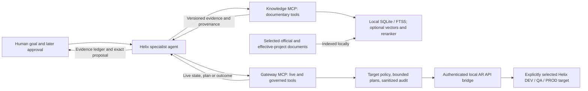

# Agent architecture: Knowledge + Gateway

One autonomous Helix specialist can use two **separate local MCP servers** through
the same MCP client. Helix MCP Knowledge provides versioned documentary evidence;
Helix MCP Gateway provides authorized live observation and governed operations.
The servers do not call each other, share a database, or transfer authorization.
Neither server embeds the agent's LLM or decision process. The agent is
responsible for comparing their outputs and for stopping at a human review
boundary before a controlled action.

The arrows back to the agent represent MCP results, not direct communication
between Knowledge and Gateway. A user goal may start autonomous investigation;
the later approval arrow does **not** grant blanket permission to execute every
operation the agent can imagine.

## Responsibility and authority

| Layer | Authoritative for | Not authoritative for |
| --- | --- | --- |
| Knowledge | What the selected official product/version documentation and effective project's documents actually say, with source and section provenance. | Current Helix state, target release alignment, Gateway policy, BMC account permission, or approval to write. |
| Gateway | The bounded live observations and policy-checked plan/apply outcomes returned for an explicit target through the authorized AR API account. | Correct interpretation of BMC documentation or human consent merely because a plan exists. |
| Agent | Keeping documentary evidence, live observations, inference, and proposals distinct; abstaining when a required link is missing. | Expanding server policy, substituting a new plan after review, or treating its own inference as measured fact. |
| Human operator | Choosing the authorized target and privately reviewing an exact proposed operation in a later turn. | Overriding Gateway policy, Helix permissions, or a failed plan precondition through conversational approval alone. |

Knowledge's `all_relevant` scope combines official sources with only the
effective project, never every registered project. For repeatable private-project
retrieval, pass the explicit `project_id` and keep official and project searches
separate. Its supported transport is `stdio`, with active-project selection
local to that server process. Gateway requires an explicit `dev`, `qa`, or `prod`
target on every live operation. Its policy can narrow, but not extend, the
selected BMC account's permissions.

## Tool routing for one agent

| Agent need | Route | Result and boundary |
| --- | --- | --- |
| Check whether applicable documentary evidence is indexed. | Knowledge `list_products`, `list_versions`, `get_sync_status`. | Readiness and version metadata, not a claim that the live target has that release. |
| Ground a technical answer or local procedure. | Knowledge `search_docs`, then `get_section`; use `source_scope=bmc_official` and an explicit project search separately when needed. | Ranked chunks and provenance. Do not replace insufficient evidence with model memory. |
| Inspect a selected live target. | Gateway `list_targets`, `health_check`, and policy-filtered `list_forms`, `list_form_fields`, `query_form`, or `get_entry` as needed. | Bounded current observations; no assumption that a documented behavior is active in this installation. |
| Prepare a read-only SQL investigation. | Gateway `plan_sql_query`, later inspect the same plan, then `execute_sql_query` only after exact human review; SQL execution requires an AR System administrator account. | Planning is non-executing; the read still accesses live business data and remains policy- and limit-bound. |
| Prepare one controlled form create or update. | Gateway `plan_create_entry` or `plan_update_entry`, later `get_write_plan`, then the matching single apply tool only after exact approval. | A temporary plan and digest bind the proposal; planning is not a Helix write or proof of human approval. |
| Verify and report. | Gateway bounded read and sanitized audit status; Knowledge citations remain separate. | A read can verify selected values. Audit metadata confirms operational outcomes but deliberately omits business payloads. |

See the complete [Knowledge tool table](../README.md#mcp-tools) and
[Gateway tool catalog](https://github.com/hvolckaert/helix-mcp-gateway/blob/main/docs/mcp-tools.md).
Neither server has a tool that gives the agent unrestricted Helix access.

## Governed sequence and abstention

1. Confirm the authorized documentary corpus and explicit live target. Check
   deployment-version alignment from authorized installation information;
   Gateway does not establish it automatically.
2. Retrieve official and, if applicable, project evidence with provenance.
   Distinguish source statements from installation-specific procedure.
3. Observe live state through minimal, bounded Gateway reads. Report any
   disagreement as a question for investigation, not a proven defect.
4. Build an evidence ledger: **official evidence**, **project procedure**,
   **deployment context**, **live observation**, **agent inference**, and
   **proposed follow-up**. Stop if a required authority or observation is missing.
5. For an executable plan, show the exact target, current and proposed values or
   SQL, reason, plan ID, digest, expiry, and expected effect. End the turn.
   The human's later explicit approval must identify the unchanged plan; the
   agent must retrieve and compare it before one execution call. Gateway checks
   policy and plan integrity, but a plan or digest alone cannot attest to human
   consent.
6. Verify a known outcome with a bounded read and report sanitized audit
   metadata separately. Do not retry an `outcome_unknown` write automatically;
   investigate whether Helix already applied it. An expired, altered, or stale
   plan requires a new review and later approval.

This method supports autonomous evidence gathering and proposal preparation,
not invisible autonomous remediation. Knowledge has no live Helix write tool;
Gateway exposes no deletion, attachments, bulk writes, or direct database
connection. Semantic search and reranking may remain disabled: the lexical
Knowledge path is valid for these workflows.

## What the written cases establish

- The [Knowledge CMDB evidence demo](cmdb-reconciliation-demo.md) is a
  lexical-only, publication-safe prompt and evidence checklist. It requires the
  reader's own authorized BMC corpus rather than redistributing BMC text.
- The [integrated CMDB data-quality case](integrated-cmdb-data-quality-case.md)
  is a read-only, synthetic DEV investigation method that keeps candidates and
  inferences separate from findings.
- The [integrated controlled-update procedure](integrated-controlled-update-case.md)
  sets out prerequisites, approval comparison, verification, and abstention
  paths. The documented Knowledge evidence check and approved Gateway DEV
  validation are separate observations; these cases **do not** claim one
  uninterrupted autonomous-agent run across both MCP sessions.

Each installation must supply its own authorized corpus, private mapping,
target-release confirmation, narrowly scoped Gateway policy, and human review.
Do not publish BMC text, private project documents, raw Helix records, credentials,
physical schema mappings, or plan identifiers in a public demonstration.
